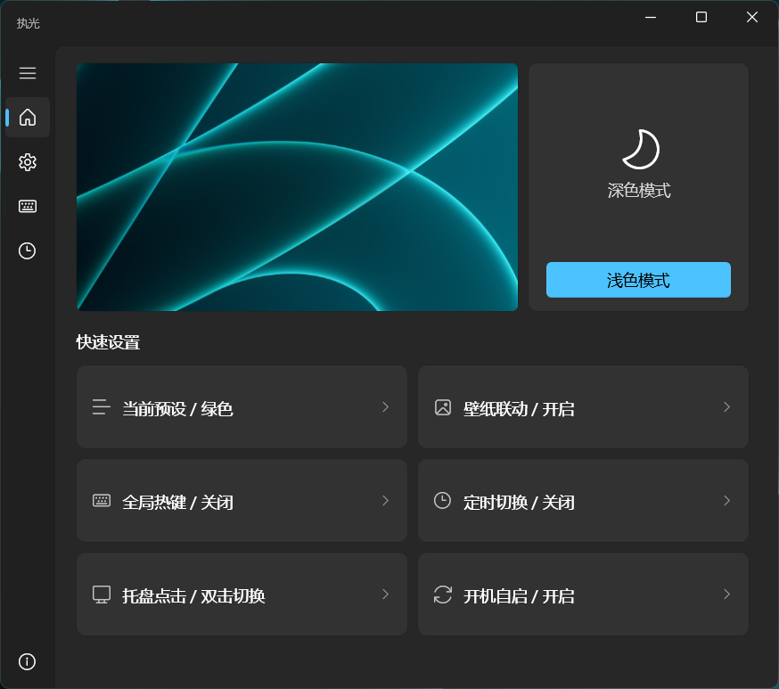
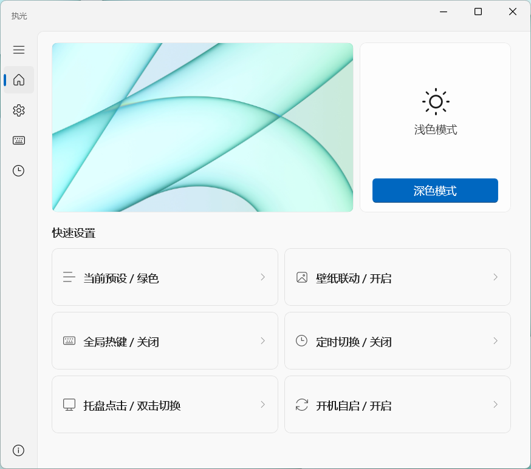

<div align="center">
  

  # Tenlux / 执光
  
  **主动掌控光与暗 —— 一款极致轻量、原生的 Windows 模式切换工具**

  [](./LICENSE.md)
  [](https://microsoft.com/windows)
  [](https://github.com/microsoft/microsoft-ui-xaml)

</div>

<br/>

<div align="center">
  
  
</div>

## ✨ 核心特性

Tenlux 是一款拒绝臃肿的轻量级工具，仅需 ~30MB 内存即可常驻系统托盘，把原本隐藏在系统深处的主题切换变成触手可及的优雅体验。

- 🌓 **一键瞬切**：单击或双击托盘图标，瞬间完成全局深浅色切换。
- 🖼️ **壁纸联动**：不仅改 UI 颜色，还能同步切换您指定的深浅色壁纸预设。
- ⏱️ **自动化流**：支持自定义时段（定时切换）或设定全局键盘热键。
- ⚡ **极致克制**：基于 WinUI 3 + .NET 10，支持 Windows 11 原生无边框毛玻璃 (Mica) 材质，直接分发独立 Exe（无需繁杂的 MSIX 打包）。
- 📦 **配置便携**：支持将所有设置甚至本地壁纸生成为“配置口令”或导出为压缩包分享。

## 📥 下载与运行

前往 [Releases 页面](../../releases) 下载最新版本的安装程序：

```text
Tenlux-2.0.0Preview-x64-Setup.exe
```

> **注意事项**：
> 1. **系统要求**：本项目支持 Windows 10 1809 (Build 17763) 及以上版本系统。受限于系统 API，原生 Mica (云母) 毛玻璃材质仅在 Windows 11 生效，在 Windows 10 下会自动降级为纯色或亚克力背景。
> 2. 当前测试版本的安装包暂未添加企业代码签名，若触发 Windows SmartScreen 拦截，请点击 `更多信息 -> 仍要运行`。

## 🕹️ 极简指南

- **开箱即用**：首次启动时，绝美的欢迎引导将带您一键完成基础自动化配置。
- **托盘交互**：
  - 左键：按配置立即翻转系统主题。
  - 右键：呼出设置面板与快捷菜单。
- **推荐热键**：建议在设置中绑定 `Ctrl + Alt + D` 等组合键作为全局强制切换热键。

## 🛠️ 从源码构建

项目采用典型的 WinUI 3 `code-behind` 架构，没有任何历史包袱。

**依赖环境**：
- Windows App SDK / WinUI 3 开发环境 (Visual Studio 2022)
- .NET 10 SDK

**快速编译**：
```powershell
# Debug 模式编译
dotnet build .\ToggleDarkMode.WinUI.csproj -c Debug -p:Platform=x64

# Release 独立发布（生成无需框架依赖的纯绿色分发包）
dotnet publish .\ToggleDarkMode.WinUI.csproj -c Release -p:Platform=x64 -r win-x64
```

## 🙋 意见反馈与问题排查

如果遇到问题，请在提交 Issue 时附带：
- 您的系统版本及 Tenlux 版本号
- 详细复现步骤与实际现象
- `关于页` 中一键导出的日志文件压缩包

## 📜 许可证

本项目基于 `CC BY-NC-SA 4.0`（知识共享-署名-非商业性使用-相同方式共享）协议开源。
您可以自由地学习、修改和演绎，但不得用于任何商业盈利行为。详情参阅 [LICENSE.md](./LICENSE.md)。

---
<div align="center">
  <i>"迷失于暗光之间，或主动掌控边界。"</i><br>
  <b>Crafted by Q1KO擎空</b>
</div>
